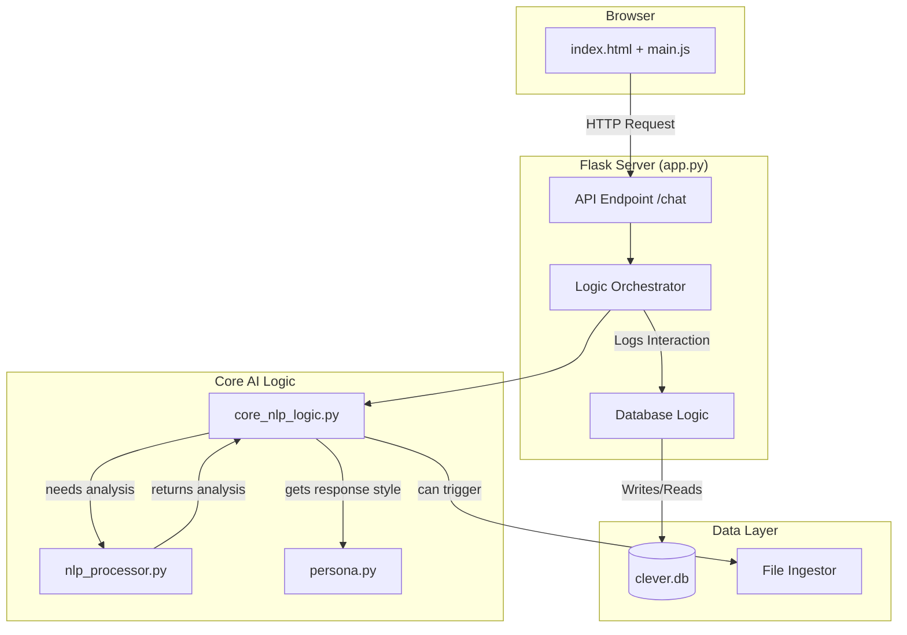

# Clever AI: Developer & Copilot Guide

**DOCUMENT PURPOSE:** This is the canonical source of truth for the Clever AI's architecture and development practices, designed for Jay's reference and as a primary context source for GitHub Copilot. It reflects the current, offline-only Flask application.

---

## 1. Project Constitution (The Unbreakable Rules)

All development **MUST** adhere to these two foundational principles. Any code or feature suggestion that violates these rules is **INVALID**.

1.  **NO INTERNET CONNECTION:** The application must remain fully functional without any network access at runtime. This means no external API calls, no cloud services, and all models/libraries must be local.
2.  **SINGLE USER (JAY):** The system is hardcoded for a single user ("Jordan", "Jay"). There is no concept of multi-tenancy, user accounts, or public access. All features are designed for Jay's specific workflow.

---

## 2. System Architecture: Offline Flask Monolith

Clever is a monolithic Flask application. All components run within a single process.

**Data Flow Diagram:**


---

## 3. Core File Responsibilities

**app.py:** Main Flask application. Handles routes (`/`, `/chat`), orchestrates calls to the core logic, and manages database sessions.

**config.py:** Stores static configuration variables like database path and NLP model names.

**core_nlp_logic.py:** The "brain." Takes structured NLP data and uses rule-based logic to determine user intent (e.g., `set_reminder`, `summarize_document`).

**nlp_processor.py:** The NLP workhorse. Takes raw text and uses spaCy, VADER, and TextBlob to extract entities, sentiment, keywords, etc.

**persona.py:** Defines Clever's personality. Contains response templates and logic to ensure communication is in-character.

**database.py:** (Recommended Refactor) Should contain all database connection and query logic to separate it from app.py.

**file_ingestor.py:** Contains functions to read, parse, and prepare text from local files for insertion into Clever's knowledge base.

---

## 4. Database Schema (clever.db)

The primary database is a single SQLite file.

**Table: user_utterances**

Purpose: Stores a complete log of all interactions for conversational memory.

Schema:
```sql
CREATE TABLE IF NOT EXISTS user_utterances (
    id INTEGER PRIMARY KEY AUTOINCREMENT,
    timestamp DATETIME NOT NULL,
    user_message TEXT NOT NULL,
    clever_response TEXT NOT NULL,
    intent_detected TEXT,
    sentiment_compound REAL
);
```

---

## 5. Operational Playbook (Makefile)

The Makefile provides shortcuts for all common development tasks.

```makefile
# Makefile for Clever AI Project

# Variables
PYTHON = python3
VENV_DIR = .venv

# Phony targets (not actual files)
.PHONY: all setup setup-full run test clean-venv watch sync-and-ingest

all: setup-full

# Setup minimal dependencies for offline run
setup: $(VENV_DIR)/bin/activate
	@echo "--> Installing minimal requirements..."
	./$(VENV_DIR)/bin/pip install -r requirements-base.txt
	@echo "--> Initializing database..."
	./$(VENV_DIR)/bin/python -c "from app import init_db; init_db()"

# Setup all dependencies, including NLP models
setup-full: $(VENV_DIR)/bin/activate
	@echo "--> Installing full requirements..."
	./$(VENV_DIR)/bin/pip install -r requirements.txt
	@echo "--> Downloading spaCy model..."
	./$(VENV_DIR)/bin/python -m spacy download en_core_web_sm
	@echo "--> Initializing database..."
	./$(VENV_DIR)/bin/python -c "from app import init_db; init_db()"

# Create virtual environment if it doesn't exist
$(VENV_DIR)/bin/activate: requirements.txt requirements-base.txt
	test -d $(VENV_DIR) || $(PYTHON) -m venv $(VENV_DIR)

# Run the Flask application
run:
	@echo "--> Starting Clever Flask server on http://localhost:5000"
	./$(VENV_DIR)/bin/flask run

# Run tests
test:
	@echo "--> Running tests..."
	./$(VENV_DIR)/bin/pytest

# Watch sync directories
watch:
	@echo "--> Watching sync directories for changes..."
	./$(VENV_DIR)/bin/python sync_watcher.py

# Best-effort rclone syncs then ingest both roots
sync-and-ingest:
	@echo "--> Syncing directories and ingesting content..."
	./$(VENV_DIR)/bin/python sync_tools.py

# Remove the virtual environment
clean-venv:
	@echo "--> Removing virtual environment..."
	rm -rf $(VENV_DIR)
```

*(Note: Assumes a requirements-base.txt for core dependencies and a sync_watcher.py script for the watch command.)*

---

## 6. Frontend Architecture

**UI Components:**
- `templates/index.html` - Main chat interface with 3D nanobot swarm
- `static/style.css` - Dark theme with neon accents, particle system styling
- `static/main.js` - Core frontend logic and API communication
- `static/nanobot_swarm.js` - 20k+ particle system with morphing behaviors
- `static/ui.js` - UI state management and user interactions
- `static/orb_renderer.js` - Central orb visualization representing Clever

**Visual Behaviors:**
- Free-hand draw attracts the swarm path
- Morph keywords: sphere, ring, torus, panel, and `write <TEXT>`
- Idle self-evolution every ~10s
- Brightness stays soft (alpha ≤ 0.25), 20k particles default

---

## 7. Testing Strategy

**Python Backend:**
- pytest-style unit tests
- No network dependencies
- Use temporary SQLite databases
- Seed data isolated per test

**Frontend:**
- DOM-only tests where feasible
- No external services
- Test particle system performance

---

## 8. Development Workflow

**Setup Commands:**
```bash
# Minimal setup (offline capable)
make setup

# Full setup with NLP models (requires internet)
make setup-full

# Start development server
make run

# Run tests
make test

# Watch for file changes and auto-ingest
make watch
```

**File Organization:**
- Keep all dependencies local (zero external CDNs)
- All fonts/assets must be local
- JavaScript/CSS must be bundled locally
- Database files (.db) are gitignored but backed up locally

---

## 9. Offline Speech-to-Text (Vosk)

To enable offline STT, place a Vosk model at `models/vosk/en-us`. Alternatively, set the `VOSK_MODEL` environment variable to the absolute path of your model directory. The `/api/stt` endpoint will then be available for WAV file uploads.

**Environment Variables:**
- `VOSK_MODEL`: absolute path to a Vosk model directory (overrides default location)

---

## 10. Remote Access in Codespaces (Tailscale)

For development within a GitHub Codespace, you can enable remote access via Tailscale. This is an opt-in feature that keeps networking outside of Clever's process, respecting the offline-first rule.

1. Add a Codespace Secret named `TAILSCALE_AUTHKEY` to this repository
2. Rebuild the devcontainer
3. The `.devcontainer/tailscale-up.sh` script will automatically configure access

---

## 11. Strategic Recommendations

**Immediate Improvements:**
- [ ] Create `requirements-base.txt` for minimal offline setup ✅ (already exists)
- [ ] Implement `sync_watcher.py` for automated file monitoring
- [ ] Refactor database logic into dedicated `database.py` module ✅ (already exists)
- [ ] Add comprehensive test suite with pytest

**Architecture Evolution:**
- [ ] Separate API logic from Flask app initialization
- [ ] Implement plugin architecture for extensible NLP processors
- [ ] Add backup/restore mechanisms for user data
- [ ] Create configuration management system

**Performance Optimizations:**
- [ ] Lazy-load NLP models for faster startup
- [ ] Implement caching layer for repeated queries
- [ ] Optimize particle system for lower-end hardware
- [ ] Add database indexing for conversation search