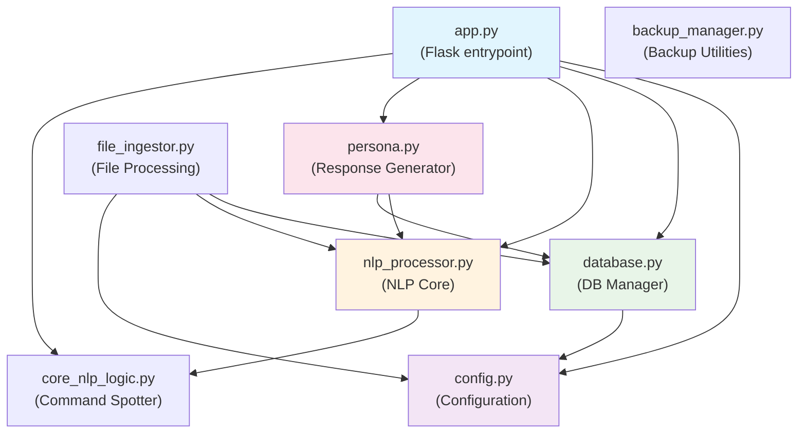

copilot/fix-645d4672-a183-4fe7-a0a8-c6ff0d030ac5
# Python Components

## Core Application Architecture

### Flask Application (`app.py`)

**Primary Responsibilities:**
- HTTP server and route handling
- API endpoint definitions
- Request/response processing
- Static file serving
- Template rendering

**Key Features:**
- Safe mode toggle for minimal dependencies
- Capabilities endpoint for system information
- File upload handling with security validation
- Integration with NLP and database components

**Routes:**
- `/` - Main application interface
- `/capabilities` - System information API
- `/upload` - File upload endpoint
- Various API endpoints for chat and analysis

### Configuration Management (`config.py`)

**Primary Responsibilities:**
- Centralized configuration settings
- Path management for all system components
- Environment-specific configurations
- Feature flags and operational modes

**Key Configurations:**
- Database paths and connection settings
- File upload restrictions and paths
- NLP model specifications
- UI behavior and theming options
- Backup and synchronization settings

### Database Layer (`database.py`)

**Primary Responsibilities:**
- SQLite connection management
- Database schema creation and migration
- CRUD operations for all data models
- Transaction management
- Data integrity and validation

**Key Classes:**
```python
class DatabaseManager:
    # Connection handling
    # Schema management
    # Query execution
    # Transaction management
```

**Tables:**
- User utterances and conversation history
- Context and memory storage
- Configuration settings
- File ingestion records

### AI Personality (`persona.py`)

**Primary Responsibilities:**
- Clever's personality definition and behavior
- Response tone and style management
- Contextual adaptation logic
- Mood and state management
- Conversation flow control

**Key Features:**
- Multiple operational modes (Deep Dive, Quick Hit, Creative, Support)
- Adaptive communication style
- Contextual memory integration
- Emotional intelligence simulation
- Jordan's idiomatic expression recognition

## Natural Language Processing

### NLP Processor (`nlp_processor.py`)

**Primary Responsibilities:**
- spaCy pipeline initialization and management
- Text analysis and entity extraction
- Sentiment analysis and intent recognition
- Document processing and summarization
- Context building from conversation history

**Key Classes:**
```python
class UnifiedNLPProcessor:
    # spaCy pipeline management
    # Text analysis methods
    # Entity extraction
    # Context building
    # Response generation
```

**Processing Pipeline:**
1. Text preprocessing and normalization
2. spaCy NLP analysis (tokenization, POS, NER)
3. Intent classification and command detection
4. Context integration and memory retrieval
5. Response generation and post-processing

### Core NLP Logic (`core_nlp_logic.py`)

**Primary Responsibilities:**
- Command recognition and classification
- Intent parsing from natural language
- Action mapping and execution planning
- Configuration upgrades and finalization
- Integration between NLP and system actions

**Key Features:**
- Command spotting and extraction
- Intent confidence scoring
- Multi-turn conversation handling
- Context-aware command interpretation
- System configuration management

## File Processing

### File Ingestor (`file_ingestor.py`)

**Primary Responsibilities:**
- Document parsing and text extraction
- File type detection and validation
- Knowledge base integration
- Content indexing and storage
- Metadata extraction and management

**Supported Formats:**
- Plain text files (.txt)
- Markdown documents (.md)
- PDF documents (.pdf)
- JSON data files

**Processing Workflow:**
1. File validation and security checks
2. Content extraction based on file type
3. NLP analysis of extracted content
4. Knowledge base integration
5. Indexing for future retrieval

## Data Management

### Backup Manager (`backup_manager.py`)

**Primary Responsibilities:**
- Automated database backups
- Backup scheduling and retention
- Restore operations and validation
- Backup integrity verification
- Archive management

**Backup Features:**
- Configurable backup intervals
- Compressed backup storage
- Backup retention policies
- Restore point validation
- Emergency recovery procedures

## TODO Items

### Code Documentation
- [ ] Add comprehensive docstrings to all Python modules
- [ ] Create type hints for all function parameters and returns
- [ ] Document exception handling patterns and error codes
- [ ] Create unit test coverage for all components
- [ ] Document performance characteristics and optimization points

### Architecture Improvements
- [ ] Implement dependency injection for better testability
- [ ] Create abstract interfaces for major components
- [ ] Document design patterns used throughout the codebase
- [ ] Create component lifecycle management documentation
- [ ] Document memory management and resource cleanup

### Integration Points
- [ ] Document inter-component communication patterns
- [ ] Create event system documentation
- [ ] Map data flow between all Python modules
- [ ] Document configuration cascading and override behavior
- [ ] Create component initialization order documentation

### Security & Validation
- [ ] Document input validation patterns
- [ ] Create security audit checklist for Python components
- [ ] Document data sanitization procedures
- [ ] Create access control and permission documentation
- [ ] Document secure coding practices used

### Performance & Monitoring
- [ ] Create performance profiling documentation
- [ ] Document memory usage patterns and optimization
- [ ] Create logging and monitoring integration
- [ ] Document scalability considerations and bottlenecks
- [ ] Create performance testing procedures

---

**Last Updated:** September 4, 2025  
**Changelog:** Initial Python components documentation - comprehensive module analysis
# Python Module Analysis - Clever AI Assistant

## Overview
Static analysis of all Python modules in the Clever AI assistant system. This offline-first Flask + SQLite + spaCy application provides natural language processing and conversation capabilities for Jay.

## Module Dependency Graph



---

## Module Details

### 1. app.py (Flask Application Entrypoint)

**Purpose**: Main Flask web server providing REST API endpoints for the Clever AI system.

**Imports**:
- External: `os`, `time`, `datetime.datetime`, `pathlib.Path`, `flask.*`, `werkzeug.utils.secure_filename`
- Local: `config`, `database.db_manager`, `nlp_processor.UnifiedNLPProcessor`, `persona.CleverPersona`, `core_nlp_logic.upgrade_configurations`, `core_nlp_logic.finalize_configurations`

**Key Globals/Config**:
- `SAFE_MODE`: `False` - Controls whether to use full NLP/DB stack or simplified mode
- `UPLOAD_DIR`: `Path("uploads")` - Directory for file uploads
- `app`: Flask application instance
- `nlp_processor`: UnifiedNLPProcessor instance (if not SAFE_MODE)
- `clever_persona`: CleverPersona instance (if not SAFE_MODE)

**Classes**: None (module-level functions only)

**Functions**:
- `capabilities()` → `jsonify` - GET /capabilities - Returns AI system metadata
- `index()` → `render_template` - GET / - Serves main UI template
- `favicon()` → `send_static_file` - GET /favicon.ico - Serves favicon
- `service_worker()` → `send_static_file` - GET /sw.js - Serves service worker
- `add_pwa_headers(resp)` → `Response` - After-request hook for PWA headers
- `health()` → `jsonify` - GET /health - Health check endpoint with DB/NLP status
- `chat()` → `jsonify` - POST /chat - Main chat endpoint, processes NLP and generates responses
- `ingest()` → `jsonify` - POST /ingest - File upload and ingestion endpoint
- `generator_page()` → `render_template` - GET /generator_page - Output generator UI
- `projects_page()` → `render_template` - GET /projects_page - Projects UI

**Side Effects**:
- Initializes Flask app with static/template folders
- Conditionally loads NLP models and database connections
- Creates upload directory
- Binds to host 0.0.0.0:5000 in debug mode

**Docstrings**: Minimal inline documentation

---

### 2. config.py (Configuration Management)

**Purpose**: Central configuration file defining paths, settings, and operational parameters.

**Imports**:
- External: `os`
- Local: None

**Key Globals/Config**:
- `BASE_DIR`: Absolute path of project root directory
- `PROJECT_PATH`: Same as BASE_DIR
- `BACKUP_DIR`: Path to backup directory
- `DB_PATH`: Path to SQLite database file (`clever.db`)
- `SYNC_DIR`: Path to sync directory (`Clever_Sync`)
- `DATABASE_NAME`: Alias for DB_PATH
- `UPLOAD_FOLDER`: Path to upload directory
- `ALLOWED_EXTENSIONS`: `{'txt', 'md', 'pdf'}` - Allowed file types
- `SPACY_MODEL`: `"en_core_web_sm"` - spaCy model name
- `UI_PIXELS_ENABLED`: `True` - UI animation flag
- `UI_DEFAULT_COLOR`: `"#FFFFFF"` - Default UI color
- `UI_DEFAULT_EXPRESSION`: `"idle"` - Default UI state
- `MODES`: `["deep_dive", "quick_hit", "creative", "support"]` - Operational modes
- `DEFAULT_MODE`: `"quick_hit"` - Default operational mode
- `OFFLINE_ONLY`: `True` - Offline-first flag
- `ALLOW_REMOTE_SYNC`: `False` - Remote sync capability flag
- `KEEP_LATEST_BACKUPS`: `1` - Number of backups to retain
- `BACKUP_ZIP_FORMAT`: `"backup_%Y-%m-%d_%H-%M-%S.zip"` - Backup filename format

**Classes**: None

**Functions**: None

**Side Effects**: Creates necessary directories, sets up project structure

**Docstrings**: Inline comments for configuration sections

---

### 3. database.py (Database Management)

**Purpose**: SQLite database management with singleton pattern for thread-safe operations.

**Imports**:
- External: `sqlite3`, `threading`
- Local: `config`, `os`

**Key Globals/Config**: None (singleton pattern)

**Classes**:

#### DatabaseManager (Singleton)
**Attributes**:
- `_instance`: Class variable for singleton instance
- `_lock`: Threading lock for singleton creation
- `_initialized`: Initialization flag
- `db_path`: Path to SQLite database file
- `conn`: SQLite connection object
- `db_lock`: Threading lock for database operations

**Init Args**: None (singleton constructor)

**Methods**:
- `__new__(cls)` → `DatabaseManager` - Singleton instance creation
- `__init__(self)` - Initialize database connection and tables
- `_ensure_tables(self)` - Create necessary database tables
- `close(self)` - Close database connection and reset singleton
- `add_source(self, filename, filepath, content)` - Add/update file source
- `get_all_sources(self)` → `List[Dict]` - Retrieve all source files
- `get_source_content_by_id(self, source_id)` → `str|None` - Get source content
- `add_fact(self, key, value)` - Add/update knowledge fact
- `get_fact(self, key)` → `str|None` - Retrieve knowledge fact
- `add_conversation(self, user_msg, ai_msg)` - Log conversation
- `get_recent_conversations(self, limit=10)` → `List[Dict]` - Get recent chats
- `set_system_mode(self, mode_name)` - Set system operational mode
- `get_system_mode(self)` → `str` - Get current system mode

**Side Effects**:
- Creates SQLite database file if not exists
- Creates tables: sources, knowledge, conversations, system_state
- Thread-safe database operations with locking
- Prints status messages to console

**Docstrings**: Minimal inline documentation

---

### 4. nlp_processor.py (Unified NLP Processing)

**Purpose**: Comprehensive natural language processing using spaCy, NLTK, and TextBlob.

**Imports**:
- External: `nltk`, `spacy`, `textblob.TextBlob`, `nltk.sentiment.SentimentIntensityAnalyzer`, `nltk.corpus.stopwords`, `nltk.tokenize.*`, `re`, `collections.*`, `datetime.datetime`, `os`
- Local: `core_nlp_logic`

**Key Globals/Config**:
- `NLTK_DATA_PATH`: Custom NLTK data directory path

**Classes**:

#### UnifiedNLPProcessor
**Attributes**:
- `nlp`: spaCy English model instance
- `sia`: NLTK VADER sentiment analyzer
- `stop_words`: Set of English stop words
- `emotion_lexicon`: Dict mapping emotions to keyword sets (joy, sadness, anger, fear, trust, surprise, disgust, anticipation)

**Init Args**: None

**Methods**:
- `process(self, text)` → `Dict` - Main NLP analysis method
- `_extract_shape(self, text)` → `str|None` - Extract shape keywords
- `_analyze_sentiment(self, text)` → `Dict` - VADER + TextBlob sentiment analysis
- `_extract_entities(self, doc)` → `List[Dict]` - spaCy named entity recognition
- `_detect_general_intent(self, text)` → `List[str]` - Intent classification
- `_extract_keywords(self, doc)` → `List[Dict]` - Extract POS-filtered keywords
- `_extract_keyphrases_rake(self, text)` → `List[str]` - RAKE-like keyphrase extraction
- `_detect_emotions(self, text)` → `Dict` - Lexicon-based emotion scoring
- `_get_language_stats(self, text)` → `Dict` - Text complexity statistics
- `_calculate_complexity(self, text, words, sentences)` → `float` - Complexity score
- `_determine_mood(self, vader_compound, textblob_polarity)` → `str` - Mood classification
- `_generate_response_suggestions(self, text)` → `List[str]` - Response recommendations
- `get_smart_response_context(self, text)` → `Dict` - Context for response generation
- `_suggest_response_tone(self, analysis)` → `str` - Tone recommendation

**Side Effects**:
- Downloads NLTK data if missing
- Loads spaCy model on initialization
- Prints status messages during model loading

**Docstrings**: Comprehensive method and class documentation

---

### 5. core_nlp_logic.py (Command Spotting)

**Purpose**: Specialized NLP for detecting specific commands and fact-based interactions.

**Imports**:
- External: `os`, `spacy`
- Local: None (but duplicates some config constants)

**Key Globals/Config**:
- Duplicates several config constants (BASE_DIR, PROJECT_PATH, etc.)
- Configuration upgrade/finalize functions

**Classes**: None

**Functions**:
- `process_text(nlp_model, text)` → `Dict` - Wrapper for backward compatibility
- `_normalize_key(key)` → `str` - Normalize fact keys (remove punctuation, determiners)
- `process_text_input(nlp_model, text)` → `Dict` - Core command detection logic
- `upgrade_configurations()` - Upgrade configuration settings
- `finalize_configurations()` - Finalize and validate configurations
- `initialize_nlp_model()` → `spacy.Language` - Load and return spaCy model

**Side Effects**:
- Loads spaCy model
- Modifies global configuration variables
- Prints error messages for model loading failures

**Docstrings**: Inline function documentation

---

### 6. persona.py (Response Generation)

**Purpose**: Clever AI personality system for generating contextual responses.

**Imports**:
- External: `random`, `re`, `logging`
- Local: Uses passed-in nlp_processor and db_manager instances

**Key Globals/Config**:
- Logging configuration set to DEBUG level

**Classes**:

#### CleverPersona
**Attributes**:
- `nlp`: NLP processor instance (passed in constructor)
- `db`: Database manager instance (passed in constructor)  
- `persona_name`: `"Clever"` - AI assistant name
- `user_name`: `"Jay"` - User name
- `last_used_trait`: Current personality trait
- `mood_map`: Dict mapping moods to personality traits
- `persona_traits`: Dict mapping traits to response templates

**Init Args**:
- `nlp_processor`: UnifiedNLPProcessor instance
- `db_manager`: DatabaseManager instance

**Methods**:
- `_swap_pronouns(self, text)` → `str` - Convert first-person to second-person pronouns
- `get_greeting(self)` → `str` - Generate random greeting
- `generate_response(self, analysis)` → `str` - Main response generation based on NLP analysis

**Side Effects**:
- Logs debugging information
- Updates database with taught facts
- Retrieves facts from database for questions
- Updates last_used_trait for personality tracking

**Docstrings**: Basic function documentation

---

### 7. backup_manager.py (Backup Utilities)

**Purpose**: Project backup and cleanup utilities using ZIP compression.

**Imports**:
- External: `os`, `pathlib.Path`, `shutil`, `time`, `zipfile`
- Local: None

**Key Globals/Config**: None

**Classes**:

#### BackupManager
**Attributes**:
- `project_path`: Path to project directory
- `backup_dir`: Path to backups subdirectory
- `keep_latest`: Number of backups to retain

**Init Args**:
- `project_path`: Project root directory path
- `keep_latest`: Number of backups to keep (default: 1)

**Methods**:
- `create_backup(self)` - Create timestamped ZIP backup
- `cleanup_old_backups(self)` - Remove backups exceeding retention limit

**Side Effects**:
- Creates backup directory if not exists
- Creates ZIP files with project contents
- Deletes old backup files
- Prints status messages

**Docstrings**: None

---

### 8. file_ingestor.py (File Processing)

**Purpose**: File ingestion system for adding documents to the knowledge base.

**Imports**:
- External: `os`, `json`
- Local: `database.db_manager`, `nlp_processor.nlp_processor`, `config`

**Key Globals/Config**: None

**Classes**:

#### FileIngestor
**Attributes**:
- `base_dir`: Directory to ingest files from

**Init Args**:
- `base_dir`: Base directory path for file ingestion

**Methods**:
- `ingest_all_files(self)` → `None` - Walk directory and ingest all files
- `ingest_file(self, file_path)` → `bool` - Process single file and add to database

**Side Effects**:
- Reads files from filesystem
- Adds file content to database via db_manager
- Prints status messages for each processed file
- Skips hidden files (starting with '.')

**Docstrings**: Basic method documentation

---

## Request Handling Call Chains

### 1. Chat Request Flow (/chat POST)
```
HTTP Request → app.chat()
├── request.get_json() → extract user message
├── nlp_processor.process(message)
│   ├── core_nlp_logic.process_text() → command detection
│   ├── spaCy analysis → entities, keywords, sentiment
│   └── return comprehensive analysis
├── persona.generate_response(analysis)
│   ├── check for teach_fact intent → db_manager.add_fact()
│   ├── check for ask_question intent → db_manager.get_fact()
│   └── generate contextual response based on mood/intent
├── db_manager.add_conversation() → log interaction
└── return JSON response with reply and analysis
```

### 2. File Ingestion Flow (/ingest POST)
```
HTTP Request → app.ingest()
├── request.files.get("file") → extract uploaded file
├── secure_filename() → sanitize filename
├── file.save() → save to upload directory
├── read file content → extract text content
├── db_manager.add_source() → store in database
└── return JSON success response
```

### 3. Health Check Flow (/health GET)
```
HTTP Request → app.health()
├── check db_manager.conn → database status
├── check nlp_processor.nlp → NLP model status  
└── return JSON status response
```

### 4. Main UI Flow (/ GET)
```
HTTP Request → app.index()
└── render_template("index.html") → serve main UI
```

---

## Entrypoints

1. **Primary Entrypoint**: `app.py` - Flask web server with REST API
2. **CLI Entrypoints**: 
   - `backup_manager.py` - Standalone backup utility
   - `file_ingestor.py` - Standalone file processing utility

---

## Changelog

### 2025-09-04
- **Added**: Complete static analysis of all Python modules
- **Added**: Module dependency graph with Mermaid visualization  
- **Added**: Detailed documentation of classes, functions, and imports
- **Added**: Request handling call chain analysis
- **Added**: Entrypoint identification and routing analysis
- **Documented**: 8 Python modules with comprehensive API analysis
- **Identified**: Flask + SQLite + spaCy architecture with offline-first design
jay-import
