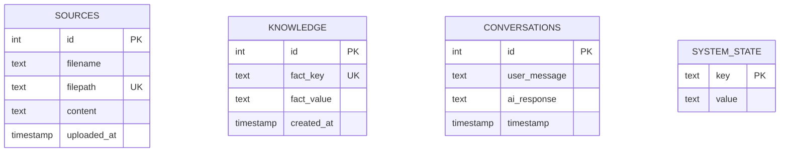

# Clever Database Documentation

## Changelog
- 2025-09-04: Initial database schema documentation and analysis

## Overview

Clever uses SQLite as its primary database (`clever_memory.db`) for offline-first operation. The database stores conversation history, file sources, knowledge facts, and system state.

## Database Schema

### Tables

#### sources
Stores uploaded files and their content for knowledge ingestion.

| Column | Type | Default | Constraints | Description |
|--------|------|---------|-------------|-------------|
| id | INTEGER | AUTO | PRIMARY KEY AUTOINCREMENT | Unique identifier |
| filename | TEXT | - | NOT NULL | Original filename |
| filepath | TEXT | - | NOT NULL, UNIQUE | Full file path on system |
| content | TEXT | - | - | Extracted text content |
| uploaded_at | TIMESTAMP | CURRENT_TIMESTAMP | DEFAULT | File upload timestamp |

**Indexes:** PRIMARY KEY on id, UNIQUE on filepath

#### knowledge
Stores facts and knowledge extracted from conversations and files.

| Column | Type | Default | Constraints | Description |
|--------|------|---------|-------------|-------------|
| id | INTEGER | AUTO | PRIMARY KEY AUTOINCREMENT | Unique identifier |
| fact_key | TEXT | - | NOT NULL, UNIQUE | Unique key for fact |
| fact_value | TEXT | - | NOT NULL | Associated fact value |
| created_at | TIMESTAMP | CURRENT_TIMESTAMP | DEFAULT | Fact creation timestamp |

**Indexes:** PRIMARY KEY on id, UNIQUE on fact_key

#### conversations
Logs all user-AI interactions for context and history.

| Column | Type | Default | Constraints | Description |
|--------|------|---------|-------------|-------------|
| id | INTEGER | AUTO | PRIMARY KEY AUTOINCREMENT | Unique identifier |
| user_message | TEXT | - | NOT NULL | User input message |
| ai_response | TEXT | - | NOT NULL | AI generated response |
| timestamp | TIMESTAMP | CURRENT_TIMESTAMP | DEFAULT | Interaction timestamp |

**Indexes:** PRIMARY KEY on id

#### system_state
Stores system configuration and state variables.

| Column | Type | Default | Constraints | Description |
|--------|------|---------|-------------|-------------|
| key | TEXT | - | PRIMARY KEY | Configuration key |
| value | TEXT | - | NOT NULL | Configuration value |

**Indexes:** PRIMARY KEY on key

## Entity Relationship Diagram



## CRUD Operations Analysis

### Write Operations (CREATE/UPDATE/DELETE)

#### `/chat` POST Route
- **Table:** `conversations`
- **Operation:** INSERT via `db_manager.add_conversation(user_msg, ai_msg)`
- **Frequency:** Every user interaction
- **Data:** User message + AI response with timestamp

#### `/ingest` POST Route  
- **Table:** `sources`
- **Operation:** INSERT OR REPLACE via `db_manager.add_source(filename, filepath, content)`
- **Frequency:** File uploads only
- **Data:** File metadata and extracted content

#### System Mode Management
- **Table:** `system_state`
- **Operation:** INSERT OR REPLACE via `db_manager.set_system_mode(mode)`
- **Frequency:** Mode changes only
- **Data:** System operational mode (deep_dive, quick_hit, creative, support)

#### Knowledge Management
- **Table:** `knowledge`
- **Operation:** INSERT OR REPLACE via `db_manager.add_fact(key, value)`
- **Frequency:** Manual fact addition
- **Data:** Key-value pairs of learned facts

### Read Operations (SELECT)

#### Recent Conversations
- **Method:** `db_manager.get_recent_conversations(limit=10)`
- **Usage:** Context for response generation
- **Performance:** Limited to recent entries for efficiency

#### File Sources
- **Method:** `db_manager.get_all_sources()` and `db_manager.get_source_content_by_id()`
- **Usage:** File management and content retrieval

#### System State
- **Method:** `db_manager.get_system_mode()`
- **Usage:** Determines AI response style and behavior

#### Knowledge Retrieval
- **Method:** `db_manager.get_fact(key)`
- **Usage:** Fact lookup for contextual responses

## Backup and Restore

### Backup Process

**Automated Backups via `backup_manager.py`:**

1. **Trigger:** Manual execution or scheduled process
2. **Method:** ZIP compression of entire project directory
3. **Location:** `/backups/` subdirectory
4. **Format:** `backup_YYYY-MM-DD_HH-MM-SS.zip`
5. **Retention:** Configurable (default: keep latest 1 backup)
6. **Scope:** Includes database file, configuration, and all project files
7. **Exclusions:** Backup directory itself to prevent recursion

**Configuration:**
```python
# In config.py
BACKUP_DIR = os.path.join(PROJECT_PATH, "backups")
KEEP_LATEST_BACKUPS = 1
BACKUP_ZIP_FORMAT = "backup_%Y-%m-%d_%H-%M-%S.zip"
```

### Restore Process

**Manual Restoration:**
1. Stop Clever application
2. Extract backup ZIP to project directory
3. Verify database file integrity: `clever_memory.db`
4. Restart application
5. Verify functionality through `/capabilities` endpoint

**Database-Only Restore:**
- SQLite database can be restored independently
- Copy `clever_memory.db` from backup
- No schema migration required (SQLite handles table creation)

### Backup Best Practices

1. **Regular Intervals:** Schedule backups before major changes
2. **Testing:** Periodically verify backup integrity
3. **Storage:** Keep backups in separate location from active database
4. **Monitoring:** Check backup success in application logs

## Database Maintenance

### Performance Considerations

- **SQLite limitations:** Single writer, suitable for personal assistant use
- **Conversation history:** May grow large over time - consider archiving
- **File content:** Large files stored as TEXT may impact performance
- **Indexes:** Automatic on PRIMARY KEY and UNIQUE constraints

### Data Retention

- No automated cleanup implemented
- Manual maintenance required for long-term operation
- Consider implementing conversation archiving for performance

## Security and Privacy

- **Local-only:** Database never transmitted over network
- **No encryption:** Plain SQLite file (offline security assumed)
- **File permissions:** Standard filesystem permissions apply
- **Backup security:** Backups contain all sensitive data - secure appropriately