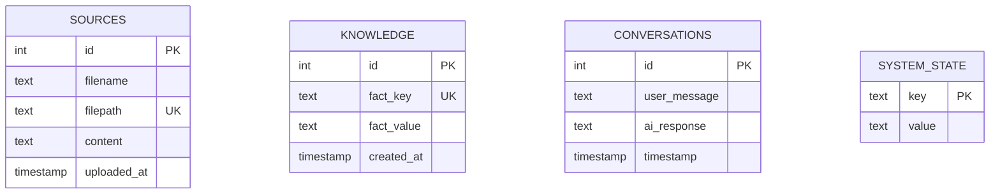

copilot/fix-645d4672-a183-4fe7-a0a8-c6ff0d030ac5
# Database Schema

## SQLite Database Structure

### Database File: `clever_memory.db`

**Location:** `/home/runner/work/projects/projects/clever_memory.db`  
**Size:** ~45KB  
**Engine:** SQLite 3  
**ACID Compliance:** Full transactional support  
**Backup Strategy:** Automated via `backup_manager.py`

## Table Schemas

### User Utterances Table

**Purpose:** Store all user interactions and conversation history

```sql
CREATE TABLE user_utterances (
    id INTEGER PRIMARY KEY AUTOINCREMENT,
    user_message TEXT NOT NULL,
    ai_response TEXT,
    timestamp DATETIME DEFAULT CURRENT_TIMESTAMP,
    session_id TEXT,
    analysis_data TEXT, -- JSON blob for NLP analysis
    context_data TEXT,  -- JSON blob for conversation context
    intent_classification TEXT,
    confidence_score REAL,
    processing_time_ms INTEGER
);
```

**Indexes:**
```sql
CREATE INDEX idx_utterances_timestamp ON user_utterances(timestamp);
CREATE INDEX idx_utterances_session ON user_utterances(session_id);
CREATE INDEX idx_utterances_intent ON user_utterances(intent_classification);
```

### Knowledge Base Table

**Purpose:** Store processed document content and extracted knowledge

```sql
CREATE TABLE knowledge_base (
    id INTEGER PRIMARY KEY AUTOINCREMENT,
    source_file TEXT NOT NULL,
    file_hash TEXT UNIQUE,
    content_type TEXT, -- 'text', 'markdown', 'pdf'
    extracted_text TEXT,
    summary TEXT,
    keywords TEXT, -- JSON array of extracted keywords
    entities TEXT, -- JSON array of NER entities
    ingestion_date DATETIME DEFAULT CURRENT_TIMESTAMP,
    last_accessed DATETIME,
    access_count INTEGER DEFAULT 0
);
```

**Indexes:**
```sql
CREATE INDEX idx_knowledge_source ON knowledge_base(source_file);
CREATE INDEX idx_knowledge_hash ON knowledge_base(file_hash);
CREATE INDEX idx_knowledge_date ON knowledge_base(ingestion_date);
```

### Context Memory Table

**Purpose:** Store long-term memory and learned preferences

```sql
CREATE TABLE context_memory (
    id INTEGER PRIMARY KEY AUTOINCREMENT,
    context_key TEXT UNIQUE NOT NULL,
    context_value TEXT, -- JSON blob
    context_type TEXT, -- 'user_preference', 'learned_fact', 'relationship'
    confidence REAL DEFAULT 0.0,
    created_date DATETIME DEFAULT CURRENT_TIMESTAMP,
    updated_date DATETIME DEFAULT CURRENT_TIMESTAMP,
    access_frequency INTEGER DEFAULT 0
);
```

**Indexes:**
```sql
CREATE INDEX idx_context_key ON context_memory(context_key);
CREATE INDEX idx_context_type ON context_memory(context_type);
CREATE INDEX idx_context_updated ON context_memory(updated_date);
```

### Session Management Table

**Purpose:** Track user sessions and interaction patterns

```sql
CREATE TABLE sessions (
    id INTEGER PRIMARY KEY AUTOINCREMENT,
    session_id TEXT UNIQUE NOT NULL,
    start_time DATETIME DEFAULT CURRENT_TIMESTAMP,
    end_time DATETIME,
    message_count INTEGER DEFAULT 0,
    active_mode TEXT, -- 'deep_dive', 'quick_hit', 'creative', 'support'
    user_mood TEXT, -- Detected user emotional state
    session_notes TEXT -- JSON blob for session-specific context
);
```

### Configuration Table

**Purpose:** Store dynamic system configuration and preferences

```sql
CREATE TABLE system_config (
    id INTEGER PRIMARY KEY AUTOINCREMENT,
    config_key TEXT UNIQUE NOT NULL,
    config_value TEXT,
    config_type TEXT, -- 'string', 'integer', 'boolean', 'json'
    description TEXT,
    last_modified DATETIME DEFAULT CURRENT_TIMESTAMP,
    modified_by TEXT DEFAULT 'system'
);
```

## Data Models & Relationships

### Entity Relationship Diagram

```
user_utterances ──→ sessions (session_id)
user_utterances ──→ context_memory (referenced in analysis)
knowledge_base ────→ context_memory (knowledge references)
sessions ──────────→ context_memory (session context)
```

### Data Types & Constraints

**Text Fields:**
- All TEXT fields support UTF-8 encoding
- JSON blobs validated before storage
- Maximum text length: SQLite default (2^31-1 bytes)

**Timestamp Format:**
- ISO 8601 format: `YYYY-MM-DDTHH:MM:SSZ`
- Stored in UTC timezone
- Automatic timezone conversion for display

**JSON Data Storage:**
- `analysis_data`: NLP processing results
- `context_data`: Conversation context and metadata  
- `keywords`: Array of extracted terms
- `entities`: Named entity recognition results
- `session_notes`: Session-specific contextual information

## Query Patterns

### Common Queries

**Recent Conversations:**
```sql
SELECT user_message, ai_response, timestamp 
FROM user_utterances 
ORDER BY timestamp DESC 
LIMIT 50;
```

**Context Retrieval:**
```sql
SELECT context_key, context_value 
FROM context_memory 
WHERE context_type = 'user_preference' 
AND confidence > 0.7;
```

**Knowledge Search:**
```sql
SELECT source_file, summary, keywords 
FROM knowledge_base 
WHERE extracted_text LIKE '%search_term%' 
ORDER BY last_accessed DESC;
```

**Session Analytics:**
```sql
SELECT active_mode, AVG(message_count), COUNT(*) as session_count
FROM sessions 
WHERE start_time > datetime('now', '-30 days')
GROUP BY active_mode;
```

## Database Operations

### Backup Procedures
- **Automated:** Daily backup via `backup_manager.py`
- **Manual:** SQLite `.backup` command
- **Validation:** Integrity check post-backup
- **Retention:** Configurable backup history (default: 7 days)

### Maintenance Operations
```sql
-- Vacuum database to reclaim space
VACUUM;

-- Analyze query performance
ANALYZE;

-- Check database integrity
PRAGMA integrity_check;

-- View database statistics
PRAGMA database_list;
PRAGMA table_info(user_utterances);
```

### Performance Considerations
- **Index Usage:** Optimized for timestamp and session queries
- **Query Planning:** Use EXPLAIN QUERY PLAN for optimization
- **Transaction Batching:** Bulk operations in single transactions
- **Connection Pooling:** Single connection per Flask request

## TODO Items

### Schema Evolution
- [ ] Document database migration procedures
- [ ] Create schema versioning system
- [ ] Implement backward compatibility for schema changes
- [ ] Document rollback procedures for failed migrations
- [ ] Create automated schema validation tools

### Performance Optimization
- [ ] Implement query performance monitoring
- [ ] Create database query optimization guidelines
- [ ] Document indexing strategy and maintenance
- [ ] Implement connection pooling for concurrent access
- [ ] Create database performance benchmarking procedures

### Data Management
- [ ] Implement data retention policies and cleanup procedures
- [ ] Create data archival strategy for old conversations
- [ ] Document data export and import procedures
- [ ] Implement data anonymization for privacy compliance
- [ ] Create data integrity validation procedures

### Security & Compliance
- [ ] Implement database encryption at rest
- [ ] Document access control and permission management
- [ ] Create audit logging for database operations
- [ ] Implement data backup encryption
- [ ] Document privacy compliance and data handling

### Advanced Features
- [ ] Implement full-text search capabilities
- [ ] Create database replication for high availability
- [ ] Implement real-time database change notifications
- [ ] Create database monitoring and alerting
- [ ] Implement automated database tuning and optimization

---

**Last Updated:** September 4, 2025  
**Changelog:** Initial database documentation - comprehensive schema and operations guide
=======
# Clever Database Documentation

## Changelog
- 2025-09-04: Initial database schema documentation and analysis

## Overview

Clever uses SQLite as its primary database (`clever_memory.db`) for offline-first operation. The database stores conversation history, file sources, knowledge facts, and system state.

## Database Schema

### Tables

#### sources
Stores uploaded files and their content for knowledge ingestion.

| Column | Type | Default | Constraints | Description |
|--------|------|---------|-------------|-------------|
| id | INTEGER | AUTO | PRIMARY KEY AUTOINCREMENT | Unique identifier |
| filename | TEXT | - | NOT NULL | Original filename |
| filepath | TEXT | - | NOT NULL, UNIQUE | Full file path on system |
| content | TEXT | - | - | Extracted text content |
| uploaded_at | TIMESTAMP | CURRENT_TIMESTAMP | DEFAULT | File upload timestamp |

**Indexes:** PRIMARY KEY on id, UNIQUE on filepath

#### knowledge
Stores facts and knowledge extracted from conversations and files.

| Column | Type | Default | Constraints | Description |
|--------|------|---------|-------------|-------------|
| id | INTEGER | AUTO | PRIMARY KEY AUTOINCREMENT | Unique identifier |
| fact_key | TEXT | - | NOT NULL, UNIQUE | Unique key for fact |
| fact_value | TEXT | - | NOT NULL | Associated fact value |
| created_at | TIMESTAMP | CURRENT_TIMESTAMP | DEFAULT | Fact creation timestamp |

**Indexes:** PRIMARY KEY on id, UNIQUE on fact_key

#### conversations
Logs all user-AI interactions for context and history.

| Column | Type | Default | Constraints | Description |
|--------|------|---------|-------------|-------------|
| id | INTEGER | AUTO | PRIMARY KEY AUTOINCREMENT | Unique identifier |
| user_message | TEXT | - | NOT NULL | User input message |
| ai_response | TEXT | - | NOT NULL | AI generated response |
| timestamp | TIMESTAMP | CURRENT_TIMESTAMP | DEFAULT | Interaction timestamp |

**Indexes:** PRIMARY KEY on id

#### system_state
Stores system configuration and state variables.

| Column | Type | Default | Constraints | Description |
|--------|------|---------|-------------|-------------|
| key | TEXT | - | PRIMARY KEY | Configuration key |
| value | TEXT | - | NOT NULL | Configuration value |

**Indexes:** PRIMARY KEY on key

## Entity Relationship Diagram



## CRUD Operations Analysis

### Write Operations (CREATE/UPDATE/DELETE)

#### `/chat` POST Route
- **Table:** `conversations`
- **Operation:** INSERT via `db_manager.add_conversation(user_msg, ai_msg)`
- **Frequency:** Every user interaction
- **Data:** User message + AI response with timestamp

#### `/ingest` POST Route  
- **Table:** `sources`
- **Operation:** INSERT OR REPLACE via `db_manager.add_source(filename, filepath, content)`
- **Frequency:** File uploads only
- **Data:** File metadata and extracted content

#### System Mode Management
- **Table:** `system_state`
- **Operation:** INSERT OR REPLACE via `db_manager.set_system_mode(mode)`
- **Frequency:** Mode changes only
- **Data:** System operational mode (deep_dive, quick_hit, creative, support)

#### Knowledge Management
- **Table:** `knowledge`
- **Operation:** INSERT OR REPLACE via `db_manager.add_fact(key, value)`
- **Frequency:** Manual fact addition
- **Data:** Key-value pairs of learned facts

### Read Operations (SELECT)

#### Recent Conversations
- **Method:** `db_manager.get_recent_conversations(limit=10)`
- **Usage:** Context for response generation
- **Performance:** Limited to recent entries for efficiency

#### File Sources
- **Method:** `db_manager.get_all_sources()` and `db_manager.get_source_content_by_id()`
- **Usage:** File management and content retrieval

#### System State
- **Method:** `db_manager.get_system_mode()`
- **Usage:** Determines AI response style and behavior

#### Knowledge Retrieval
- **Method:** `db_manager.get_fact(key)`
- **Usage:** Fact lookup for contextual responses

## Backup and Restore

### Backup Process

**Automated Backups via `backup_manager.py`:**

1. **Trigger:** Manual execution or scheduled process
2. **Method:** ZIP compression of entire project directory
3. **Location:** `/backups/` subdirectory
4. **Format:** `backup_YYYY-MM-DD_HH-MM-SS.zip`
5. **Retention:** Configurable (default: keep latest 1 backup)
6. **Scope:** Includes database file, configuration, and all project files
7. **Exclusions:** Backup directory itself to prevent recursion

**Configuration:**
```python
# In config.py
BACKUP_DIR = os.path.join(PROJECT_PATH, "backups")
KEEP_LATEST_BACKUPS = 1
BACKUP_ZIP_FORMAT = "backup_%Y-%m-%d_%H-%M-%S.zip"
```

### Restore Process

**Manual Restoration:**
1. Stop Clever application
2. Extract backup ZIP to project directory
3. Verify database file integrity: `clever_memory.db`
4. Restart application
5. Verify functionality through `/capabilities` endpoint

**Database-Only Restore:**
- SQLite database can be restored independently
- Copy `clever_memory.db` from backup
- No schema migration required (SQLite handles table creation)

### Backup Best Practices

1. **Regular Intervals:** Schedule backups before major changes
2. **Testing:** Periodically verify backup integrity
3. **Storage:** Keep backups in separate location from active database
4. **Monitoring:** Check backup success in application logs

## Database Maintenance

### Performance Considerations

- **SQLite limitations:** Single writer, suitable for personal assistant use
- **Conversation history:** May grow large over time - consider archiving
- **File content:** Large files stored as TEXT may impact performance
- **Indexes:** Automatic on PRIMARY KEY and UNIQUE constraints

### Data Retention

- No automated cleanup implemented
- Manual maintenance required for long-term operation
- Consider implementing conversation archiving for performance

## Security and Privacy

- **Local-only:** Database never transmitted over network
- **No encryption:** Plain SQLite file (offline security assumed)
- **File permissions:** Standard filesystem permissions apply
- **Backup security:** Backups contain all sensitive data - secure appropriately
jay-import
